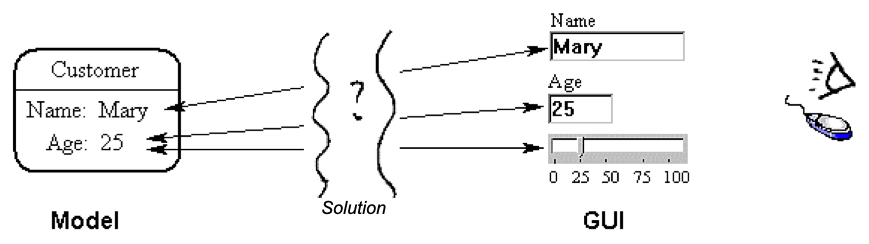

# MGM (Model Gui Mediator) Pattern

This design pattern (written in 2000) available to view [here](https://abulka.github.io/todomvc-oo/pdf_as_html/andybulkamodelguimediatorpattern.html).

The MGM pattern is an early version of the [MVCA](https://github.com/abulka/todomvc-oo) pattern.

## Thoughts twenty years later...

Its now 2020 in the midst of the Corona virus. Re-reading my MGM pattern many years later, I notice that:

- Its a very old paper that I wrote when I was young, and it tried to clarify what the 'view' was and the exact nature and role of the 'controller'. Looking back on it, its a historical moment which later led to my [TodoMVC-OO](https://github.com/abulka/todomvc-oo) implementation using the more refined MVCA pattern.

- Its more understandable if you think of the 'Mediator' as a 'Controller'. I could have used the term Controller more liberally, but at the time I wanted to emphasise the unclarity of various definitions of Controller, and emphasise the Mediator design pattern that detected in MVC. I have corrected this in the later [MVCA](https://github.com/abulka/todomvc-oo) pattern where... the Controller is back!  Its still a Mediator though 😉

- Its more understandable if you think of the 'GUI' as 'View'. I could have used the term View more liberally, but at the time I wanted to emphasise the unclarity of various definitions of View, and emphasise the use of off the shelf GUI widgets as part of a GUI framework.  After all, in the 1960's Views were often user code that drew lines onto a canvas to make widgets - such early days.

- MGM referred to tags in GUI widgets, which I suppose these days would be equivalent to DOM elements having attributes or id's. MGM could have made more references to GUI widgets communicating to Controller/Mediator via events - you don't need the tag stuff.

- Originally no default implementation or GitHub repo.  Now we do!  See [TodoMVC-OO](https://github.com/abulka/todomvc-oo)

- MGM is quite academically written and a bit long winded - [MVCA](https://github.com/abulka/todomvc-oo) is a more modern, succinct version of the same ideas, with better diagrams.

- MGM doesn't talk about the essential role of an Application object - something I have corrected in [MVCA](https://github.com/abulka/todomvc-oo) 

<!-- In MGM and MVCA or any other MVC variant, you might need to watch out for a double update or even an update loop?  Setting the model (from the mediator) might trigger another notification to the mediator? This is inefficient and may cause an unecessary double refresh of the GUI. However modifying the model secretly may mean other mediators miss out on their updates. So the only thing to do is for the mediator to intercept the update to itself (as a result of it setting the model) and stopping it. How this is done is tricky, probably just check the value and if the value is already set, ignore the notification message. Actually this is probably a good overal optimisation anyway! -->

<!-- Warning: Somehow MGM pattern webpage (old version) is still active!?
This is the proper anypatterns site
http://www.andypatterns.com/index.php/design_patterns/model_gui_mediator_pattern/ -->

