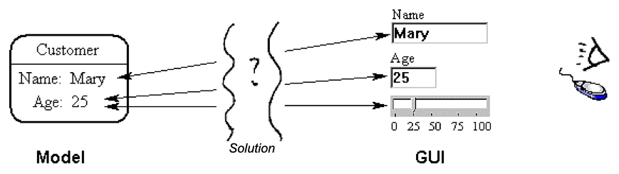

# MGM (Model Gui Mediator) Pattern

This design pattern (written in 2000) available to view [here](https://abulka.github.io/todomvc-oo/pdf_as_html/andybulkamodelguimediatorpattern.html).

This is my old MGM pattern which is very similar to what has been implemented in the article. Its a very old paper I wrote when I was young, and it tried to clarify what the 'view' was and the exact nature and role of the controller. Looking back on it, its a historical moment which later led to the TodoMVC-OO implementation here, and the MVC-A pattern.

Its more understandable if you think of the 'mediator' as a 'Controller'. 

# MGM pattern revisited
(taken from Mac notes, exported)

http://www.andypatterns.com/index.php/design_patterns/model_gui_mediator_pattern/

My article didn't mention that you can have code in the GUI control which directly accesses the mediator - you don't need the tag stuff.

GUI could potentially access model directly. No big deal.

The update loop of setting the model (from the mediator) might trigger another notification to the mediator. This is inefficient and may cause an unecessary double refresh of the GUI. However modifying the model secretly may mean other mediators miss out on their updates. So the only thing to do is for the mediator to intercept the update to itself (as a result of it setting the model) and stopping it. How this is done is tricky, probably just check the value and if the value is already set, ignore the notification message. Actually this is probably a good overal optimisation anyway!

Originally no default implementation or github repo.  Now we do!

Warning: Somehow MGM pattern webpage (old version) is still active!?

---

